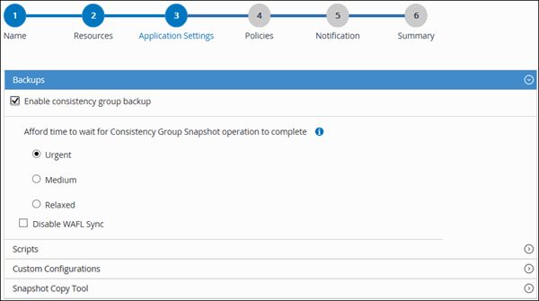

= 备份 SAP HANA 数据库
:allow-uri-read: 
:icons: font
:imagesdir: ../media/

[role="lead"]
如果某个资源尚未加入任何资源组，您可以从 "Resources" 页面备份该资源。

.开始之前
* 您必须已创建备份策略。
* 如果要备份与二级存储具有 SnapMirror 关系的资源，则分配给存储用户的 ONTAP 角色应包括 " `snapmirror all` " 权限。但是，如果您使用的是 "`vsadmin` " 角色，则不需要 " `snapmirror all` " 特权。
* 对于基于 Snapshot 副本的备份操作，请确保所有租户数据库均有效且处于活动状态。
* 要创建 SAP HANA 系统复制备份，建议将 SAP HANA 系统的所有资源添加到一个资源组中。这样可以确保在接管 - 故障恢复模式下进行无缝备份。
+
link:task_create_resource_groups_and_attach_policies.html["创建资源组并附加策略"]。

+
link:task_back_up_resource_groups_sap_hana.html["备份资源组"]

* 如果要在一个或多个租户数据库关闭时创建基于文件的备份，请使用 `SET-SmConfigSettings` cmdlet 在 HANA 属性文件中将 allow_file_based _backup_IFINACTIVE_tenants_present 参数设置为 * 是 * 。
+
有关可与 cmdlet 结合使用的参数及其说明的信息，可通过运行 get-help _command_name_ 来获取。或者，您也可以参考 https://library.netapp.com/ecm/ecm_download_file/ECMLP2886205["《 SnapCenter 软件 cmdlet 参考指南》"]

* 对于用于暂停、Snapshot副本和取消静默操作的预后和后命令、您应通过以下路径检查这些命令是否位于插件主机上的命令列表中：
+
对于Windows：_C：\Program Files\NetApp\SnapCenter\SnapCenter Plug-in Creator\etc\allowed_commands_list.txt

+
对于Linux：/var/opt/snapcenter/scC/allowed_commands_list.txt

NOTE: 如果命令列表中不存在这些命令、则操作将失败。

.步骤
. 在左侧导航窗格中，选择*Resoles*，然后从列表中选择相应的插件。
. 在资源页面中，根据资源类型从 * 视图 * 下拉列表中筛选资源。
+
选择*image:../media/filter_icon.png[""]* ，然后选择主机名和资源类型以筛选资源。然后、您可以选择 image:../media/filter_icon.png[""] 以关闭筛选器窗格。

. 选择要备份的资源。
. 在资源页面中，选择 * 对 Snapshot 副本使用自定义名称格式 * ，然后输入要用于 Snapshot 副本名称的自定义名称格式。
+
例如， _customtext_policy_hostname_ 或 _resource_hostname_ 。默认情况下， Snapshot 副本名称会附加时间戳。

. 在应用程序设置页面中，执行以下操作：
+
** 选择*备份*箭头以设置其他备份选项：
+
根据需要启用一致性组备份，并执行以下任务：

+
|===
| 对于此字段 ... | 执行此操作 ... 

 a| 
等待 "Consistency Group Snapshot" 操作完成的时间
 a| 
选择 * 紧急 * ， * 中 * 或 * 宽松 * 以指定 Snapshot 副本操作完成的等待时间。紧急 = 5 秒，中等 = 7 秒，宽松 = 20 秒。

 a| 
禁用 WAFL 同步
 a| 
选择此选项可避免强制设置 WAFL 一致点。

|===
** 选择*Scripts*箭头可运行用于静修、Snapshot副本和取消静修操作的PRE和POST命令。
+
您也可以在退出备份操作之前运行 PRE 命令。预处理脚本和后处理脚本在 SnapCenter 服务器中运行。

** 选择**自定义配置**箭头，然后输入使用此资源的所有作业所需的自定义值对。
** 选择*Snapshot副本工具*箭头以选择用于创建Snapshot副本的工具：
+
|===
| 如果您希望 ... | 那么 ... 

 a| 
SnapCenter 以创建存储级别的 Snapshot 副本
 a| 
选择 * 不使用文件系统一致性的 SnapCenter * 。

 a| 
SnapCenter 以使用适用于 Windows 的插件将文件系统置于一致状态，然后创建 Snapshot 副本
 a| 
选择 * 具有文件系统一致性的 SnapCenter * 。

 a| 
可输入命令以创建 Snapshot 副本
 a| 
选择 * 其他 * ，然后输入命令创建 Snapshot 副本。

|===
+

. 在策略页面中，执行以下步骤：
+
.. 从下拉列表中选择一个或多个策略。
+

NOTE: 您也可以单击 * 来创建策略image:../media/add_policy_from_resourcegroup.gif[""]*

+
在为选定策略配置计划部分中，将列出选定策略。

.. 选择*image:../media/add_policy_from_resourcegroup.gif[""]* 。
.. 在为policy _policy_name_添加计划对话框中，配置该计划，然后选择*OK*。
+
_policy_name_ 是所选策略的名称。

+
已配置的计划将列在 "applied Schedules" 列中。

. 在通知页面的 * 电子邮件首选项 * 下拉列表中，选择要发送电子邮件的场景。
+
您还必须指定发件人和收件人电子邮件地址以及电子邮件主题。此外，还必须在 * 设置 * > * 全局设置 * 中配置 SMTP 。

. 查看摘要，然后选择*完成*。
+
此时将显示资源拓扑页面。

. 选择*立即备份*。
. 在备份页面中，执行以下步骤：
+
.. 如果对资源应用了多个策略，请从 * 策略 * 下拉列表中选择要用于备份的策略。
+
如果为按需备份选择的策略与备份计划关联，则按需备份将根据为计划类型指定的保留设置进行保留。

.. 选择 * 备份 * 。

. 单击 * 监控 * > * 作业 * 以监控操作进度。
+
** 在 MetroCluster 配置中， SnapCenter 可能无法在故障转移后检测到保护关系。
+
有关信息，请参见 https://kb.netapp.com/Advice_and_Troubleshooting/Data_Protection_and_Security/SnapCenter/Unable_to_detect_SnapMirror_or_SnapVault_relationship_after_MetroCluster_failover["MetroCluster 故障转移后无法检测 SnapMirror 或 SnapVault 关系"^]

** 如果要备份 VMDK 上的应用程序数据，并且适用于 VMware vSphere 的 SnapCenter 插件的 Java 堆大小不够大，则备份可能会失败。
+
要增加 Java 堆大小，请找到脚本文件 _/opt/netapp/init_scripts/scvservice_ 。在该脚本中， _do_start method 命令将启动 SnapCenter VMware 插件服务。将该命令更新为以下命令： _java -JAR -Xmx8192M -Xms4096M_

