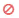

= 监控 SAP HANA 数据库克隆操作
:allow-uri-read: 
:icons: font
:imagesdir: ../media/

[role="lead"]
您可以使用作业页面监控 SnapCenter 克隆操作的进度。您可能需要检查操作的进度，以确定操作何时完成或是否存在问题描述。

.关于此任务
以下图标将显示在作业页面上，并指示操作的状态：

* image:../media/progress_icon.gif["正在进行中图标"] 正在进行中
* image:../media/success_icon.gif["已完成图标"] 已成功完成
* image:../media/failed_icon.gif["失败图标"] 失败
* image:../media/warning_icon.gif["已完成，但显示警告图标"] 已完成，但出现警告或由于出现警告而无法启动
* image:../media/verification_job_in_queue.gif["验证作业已排队"] 已排队
*  已取消

* 步骤 *

. 在左侧导航窗格中，单击 * 监控 * 。
. 在 * 监控 * 页面中，单击 * 作业 * 。
. 在 * 作业 * 页面中，执行以下步骤：
+
.. 单击 image:../media/filter_icon.gif["筛选器图标"] 以筛选列表、以便仅列出克隆操作。
.. 指定开始日期和结束日期。
.. 从 * 类型 * 下拉列表中，选择 * 克隆 * 。
.. 从 * 状态 * 下拉列表中，选择克隆状态。
.. 单击 * 应用 * 以查看已成功完成的操作。

. 选择克隆作业，然后单击 * 详细信息 * 以查看作业详细信息。
. 在作业详细信息页面中，单击 * 查看日志 * 。

