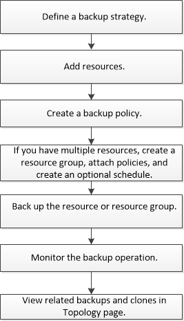

= 备份SnapCenter自定义插件资源
:allow-uri-read: 
:icons: font
:imagesdir: ../media/

[role="lead"]
备份工作流包括规划，确定要备份的资源，管理备份策略，创建资源组和附加策略，创建备份以及监控操作。

以下工作流显示了必须执行备份操作的顺序：

您也可以手动或在脚本中使用 PowerShell cmdlet 执行备份，还原和克隆操作。有关PowerShell cmdlet的详细信息、请使用SnapCenter cmdlet帮助或参阅 https://docs.netapp.com/us-en/snapcenter-cmdlets/index.html["《 SnapCenter 软件 cmdlet 参考指南》"]
