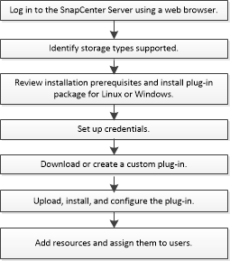

= SnapCenter 自定义插件的安装工作流
:allow-uri-read: 
:icons: font
:imagesdir: ../media/

[role="lead"]
如果要保护自定义插件资源，应安装和设置 SnapCenter 自定义插件。

link:develop_a_plug_in_for_your_application.html["为您的应用程序开发一个插件"]
