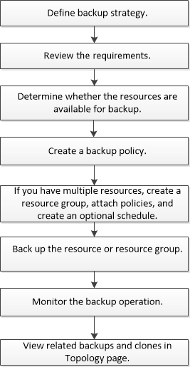

= 备份操作步骤 概述
:allow-uri-read: 
:icons: font
:imagesdir: ../media/

[role="lead"]
您可以为资源（数据库）或资源组创建备份。备份操作步骤 包括规划、确定备份资源、创建备份策略、创建资源组和附加策略、创建备份以及监控操作。

以下工作流显示了必须执行备份操作的顺序：

为Oracle数据库创建备份时、会在Oracle数据库主机上的/var/opt/snapcenter/soc/lock_目录中创建一个操作锁定文件(_.sm_lock_dbsid_)、以避免对数据库执行多个操作。备份数据库后，操作锁定文件将自动删除。

但是，如果上次备份完成并显示警告，则操作锁定文件可能不会被删除，下次备份操作将进入等待队列。如果未删除 * 。 sm_lock_dbsid* 文件，则此文件最终可能会被取消。在这种情况下、您必须执行以下步骤来手动删除操作锁定文件：

. 在命令提示符处、导航到_/var/opt/snapcenter/soc/lock_。
. 删除操作锁定：``rm -rf .sm_lock_dbsid.``

